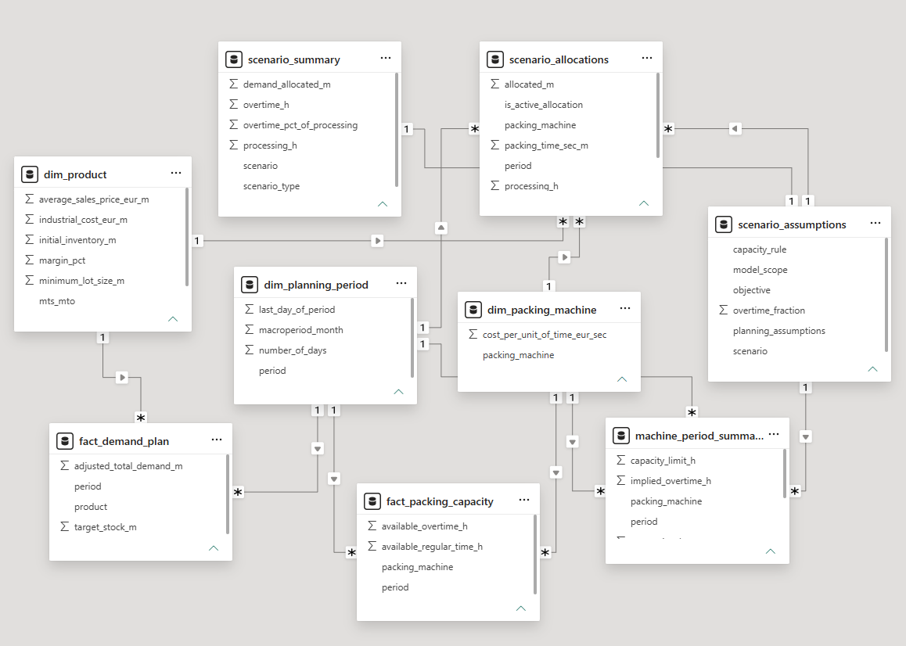
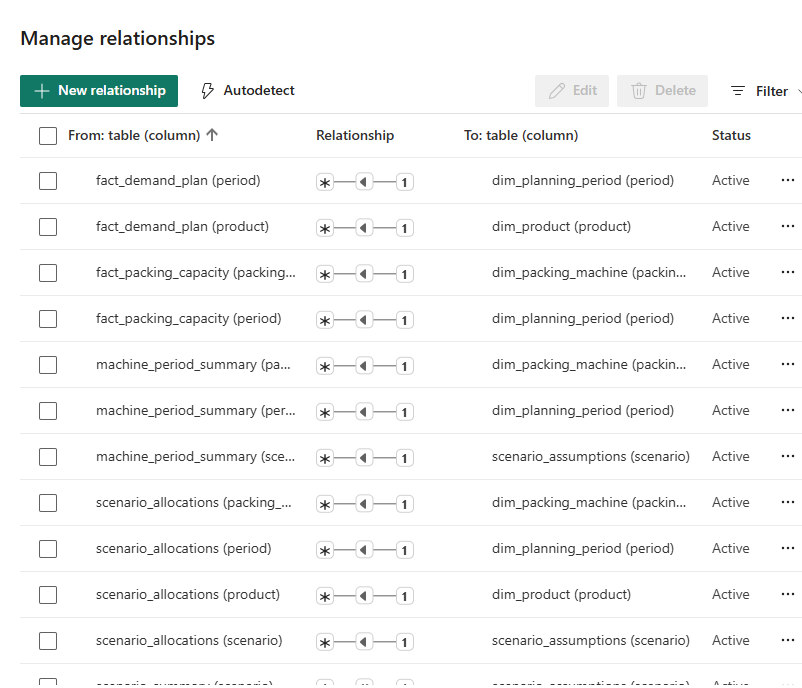
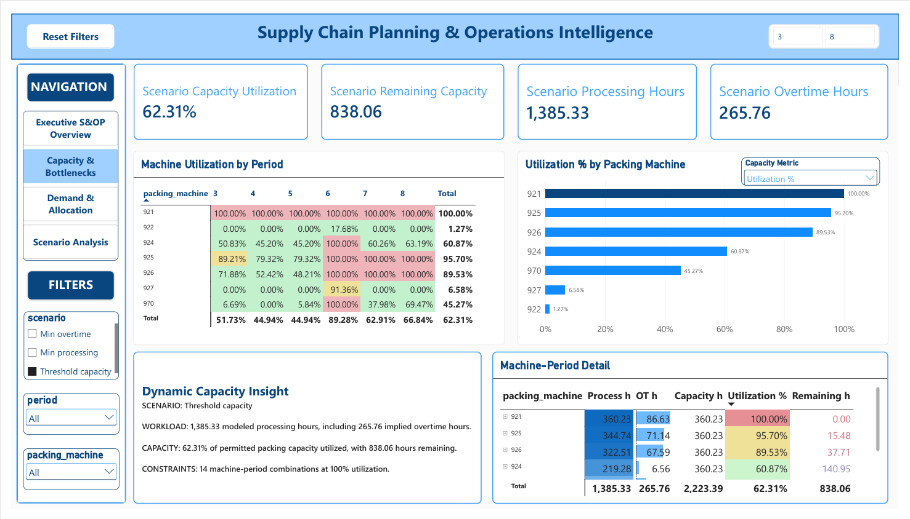
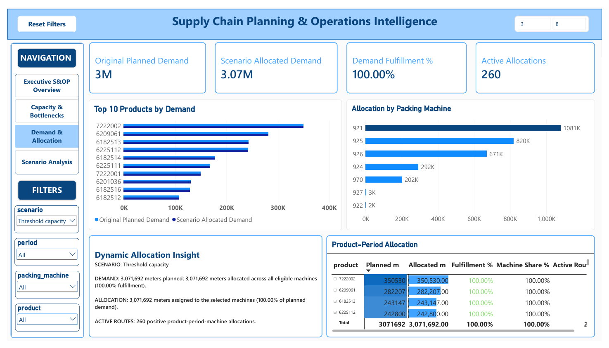
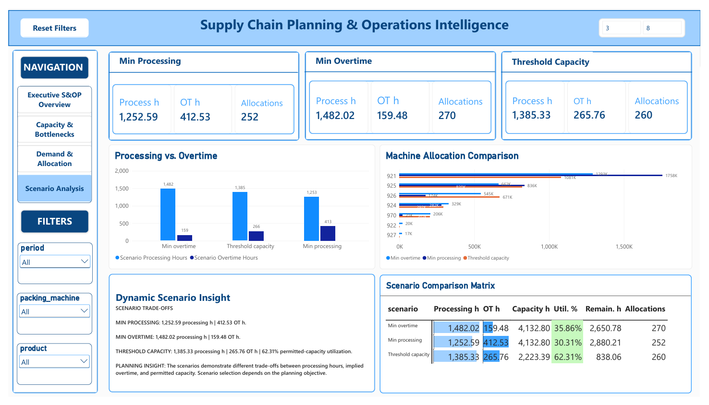

# Project #4 — Supply Chain Planning & Operations Intelligence

**Databricks • Python • SQL • Power BI • Supply Chain Analytics • S&OP • Optimization • Business Intelligence**

An end-to-end manufacturing supply chain planning analytics solution integrating data engineering, dimensional modeling, SQL analytics, Python optimization, and interactive Power BI reporting to support demand, capacity, resource allocation, and management decision-making.

---

## 📌 Project Overview

This project transforms manufacturing S&OP planning data into an integrated analytical and decision-support solution.

The workflow begins with raw Excel data, progresses through a **Databricks Bronze–Silver–Gold architecture**, and combines SQL analytics, Python optimization, and Power BI to evaluate planning constraints and alternative resource-allocation strategies.

The project demonstrates the complete analytical lifecycle—from source ingestion and data validation to optimization, visualization, and management recommendations.

## 🎯 Business Problem

Manufacturing planning requires balancing demand fulfillment, machine capacity, processing efficiency, and overtime exposure.

However, **aggregate available capacity does not guarantee usable capacity at the required machine and planning period**.

Management needs visibility into localized constraints, workload concentration, and the operational trade-offs created by different optimization objectives.

**Core Business Question:** How can planned demand be fulfilled while managing processing requirements, implied overtime, machine-level capacity constraints, and resource dependency?

## 🔎 Analysis Objectives

- Evaluate planned demand and available capacity across planning periods.
- Identify machine-level bottlenecks and localized capacity pressure.
- Analyze product demand and modeled resource allocation.
- Develop alternative optimization scenarios using Python.
- Compare processing hours, implied overtime, and machine-allocation trade-offs.
- Translate analytical findings into actionable management decision support.

---

## 🏗️ Data Engineering & Analytical Architecture

**21 Bronze Tables → 21 Silver Tables → 12 Gold Analytical Tables → 4 Optimization Scenario Tables → Power BI Decision-Support Dashboard**

The Databricks architecture separates raw source ingestion, transformation, quality validation, dimensional modeling, and optimization outputs to support traceable analytical reporting.

### 📓 6 End-to-End Databricks Analytics Notebooks

| Notebook | Analytical Purpose |
|---|---|
| [01_Load_Raw_SOP_Source](notebooks/01_Load_Raw_SOP_Source.ipynb) | Ingest manufacturing S&OP source data into Bronze Delta tables. |
| [02_Transform_Clean_SOP_Data](notebooks/02_Transform_Clean_SOP_Data.ipynb) | Clean, standardize, and transform source data into Silver tables. |
| [03_Validate_SOP_Data_Quality](notebooks/03_Validate_SOP_Data_Quality.ipynb) | Validate data quality, integrity, and source reconciliation. |
| [04_Build_Gold_Data_Warehouse](notebooks/04_Build_Gold_Data_Warehouse.ipynb) | Build analysis-ready Gold dimensional and fact tables. |
| [05_Supply_Chain_SQL_Analytics](notebooks/05_Supply_Chain_SQL_Analytics.ipynb) | Analyze demand, capacity, routing relationships, and planning constraints. |
| [06_Supply_Chain_Python_Analytics](notebooks/06_Supply_Chain_Python_Analytics.ipynb) | Develop optimization scenarios and evaluate workload-allocation trade-offs. |

### 🏗️ 12 Gold Analytical Tables

**4 Dimension Tables**
- `dim_product`
- `dim_machine`
- `dim_packing_machine`
- `dim_planning_period`

**4 Fact Tables**
- `fact_customer_order`
- `fact_demand_plan`
- `fact_machine_capacity`
- `fact_packing_capacity`

**4 Bridge Tables**
- `bridge_product_production`
- `bridge_product_packing`
- `bridge_product_raw_material`
- `bridge_alternative_machine`

These tables provide the analytical foundation for demand, capacity, product, machine, and planning-period analysis.

### 🐍 4 Optimization Scenario Tables

- `machine_period_summary` — Machine-period processing, capacity, and utilization metrics.
- `scenario_allocations` — Modeled product-period-machine allocations.
- `scenario_assumptions` — Optimization scenario definitions and assumptions.
- `scenario_summary` — Scenario-level fulfillment, processing, and overtime results.

**Optimization Scenarios:** Min Processing • Min Overtime • Threshold Capacity

---

## 🗃️ Dataset & Analytical Model

**Source:** Manufacturing S&OP planning dataset supplied in an Excel workbook (`Instance data.xlsx`).

The source includes product information, customer orders, demand plans, machine capacities, production alternatives, material requirements, transportation, and packing relationships.

The analytical model integrates original planning data with Python-generated optimization results.

### Power BI Data Model



The model integrates **12 Gold analytical tables and 4 optimization scenario tables** to support reporting across demand, products, machines, capacity, and scenario results.

### Relationship Details



The relationship structure enables consistent analysis across planning periods, product demand, machine capacity, and optimization scenarios.

---

## 🛠️ Tools & Technologies

| Technology | Application |
|---|---|
| **Excel** | Original manufacturing S&OP source data |
| **Databricks / PySpark / Delta Lake** | Data engineering, Bronze–Silver–Gold architecture, and data validation |
| **SQL** | Data querying, validation, aggregation, and planning analysis |
| **Python / pandas / SciPy** | Linear programming, scenario optimization, and analytical calculations |
| **Power BI / DAX** | Data modeling, interactive dashboards, KPIs, and decision support |
| **GitHub** | Project documentation and technical portfolio |

## ⚙️ End-to-End Analytical Workflow

**01 — Data Ingestion:** Extract and structure raw manufacturing planning data.

**02 — Bronze Layer:** Preserve source records in Delta tables.

**03 — Silver Layer:** Clean, standardize, transform, and validate source data.

**04 — Gold Layer:** Develop analysis-ready dimensional and fact tables.

**05 — SQL Analytics:** Evaluate demand, capacity, routing, and planning relationships.

**06 — Python Optimization:** Develop three planning scenarios using linear programming.

**07 — Power BI Integration:** Combine Gold and scenario models into interactive analytical reports.

**08 — Management Decision Support:** Interpret findings, evaluate risks, compare trade-offs, and develop planning recommendations.

---

## 📊 Power BI — Management Decision-Support Dashboard

The four-page interactive Power BI dashboard connects original S&OP planning data with modeled optimization results.

### 1. Executive S&OP Overview


Monitors planned demand, modeled fulfillment, processing requirements, implied overtime, and planning trends.

### 2. Capacity & Bottlenecks



Identifies localized capacity pressure, remaining permitted capacity, and constrained machine-period combinations.

### 3. Demand & Allocation



Analyzes product-level demand, modeled fulfillment, and workload distribution across packing machines.

### 4. Scenario Analysis



Compares **Min Processing, Min Overtime, and Threshold Capacity** to evaluate processing-hour, overtime, and machine-allocation trade-offs.

**Advanced Power BI Capabilities:** DAX Measures • Dynamic Management Narratives • Conditional Formatting • Slicers • Field Parameters • Report-Page Tooltips • Product Drillthrough • Interactive Scenario Comparison

📊 [Explore Dashboard Screenshots & Data Model](dashboard/)

### 🎥 Dashboard Walkthrough

▶️ **[Watch Dashboard Walkthrough on YouTube](https://youtu.be/kEhXbw9GKmU)**

The walkthrough demonstrates dashboard navigation, analytical insights, interactive features, and management decision-support applications.

---

## 🔍 Key Findings & Business Insights

**1. Full Modeled Demand Fulfillment**

All three scenarios allocate **3,071,692 meters (100%)** of planned demand within their modeled constraints.

**2. Demand Concentration**

Approximately **72% of planned demand occurs in periods P7–P8**, creating significant late-horizon workload concentration.

**3. Aggregate Headroom Masks Localized Constraints**

Under Threshold Capacity, aggregate permitted packing-capacity utilization is **62.31%**, yet **14 machine-period combinations reach 100% modeled utilization**.

**4. Machine-Level Capacity Dependency**

Machine 921 reaches **100% modeled utilization across P3–P8** under Threshold Capacity, indicating a priority area for routing and capacity analysis.

**5. Optimization Objectives Change Resource Allocation**

Machine 921 receives approximately **1.758M meters under Min Processing**, compared with **1.081M meters under Threshold Capacity**.

This demonstrates how alternative objectives change workload distribution across eligible machines.

**6. Processing–Overtime Trade-offs**

| Optimization Scenario | Processing Hours | Implied Overtime Hours |
|---|---:|---:|
| Min Processing | 1,252.59 | 412.53 |
| Min Overtime | 1,482.02 | 159.48 |
| Threshold Capacity | 1,385.33 | 265.76 |

Different objectives produce different operational trade-offs; no scenario is universally preferable.

---

## 💡 Management Takeaway

**Aggregate capacity does not necessarily represent usable capacity at the required machine and planning period.**

The analysis demonstrates that full modeled demand fulfillment can coexist with localized capacity constraints and resource concentration.

Effective planning requires evaluating not only overall capacity and processing efficiency, but also **where workload is assigned, which machines become constrained, and how different objectives influence resource dependency**.

## 🎯 Recommendations & Decision Support

- **Monitor localized constraints:** Prioritize machine-period combinations approaching permitted capacity limits.
- **Investigate Machine 921 dependency:** Evaluate eligible alternative routes and available capacity.
- **Assess routing flexibility:** Examine whether workload can be redistributed without creating new constraints.
- **Compare optimization objectives:** Align scenario selection with processing efficiency, overtime reduction, or capacity-control priorities.
- **Perform sensitivity analysis:** Test reduced-capacity scenarios for critical machines.
- **Support recurring planning reviews:** Use dashboard insights to evaluate allocation and capacity trade-offs.

**Decision Framework:** Business Priority → Scenario Selection → KPI Comparison → Machine Allocation Review → Capacity Risk Assessment → Management Decision

---

## 📈 Business Analysis Presentation

The management-focused presentation translates technical findings into business risks, diagnostic priorities, scenario trade-offs, and actionable recommendations.

📈 **[View Business Analysis Presentation](https://youtu.be/Q87L0mOYfuo)**

🎬 **Watch Business Analysis Presentation on YouTube** 

---

## 📂 Repository Structure

```text
supply-chain-planning-optimization/
│
├── README.md
│
├── notebooks/
│   ├── README.md
│   ├── 01_Load_Raw_SOP_Source.ipynb
│   ├── 02_Transform_Clean_SOP_Data.ipynb
│   ├── 03_Validate_SOP_Data_Quality.ipynb
│   ├── 04_Build_Gold_Data_Warehouse.ipynb
│   ├── 05_Supply_Chain_SQL_Analytics.ipynb
│   └── 06_Supply_Chain_Python_Analytics.ipynb
│
├── dashboard/
│   ├── README.md
│   ├── 01_Executive_S&OP_Overview.png
│   ├── 02_Capacity_Bottlenecks.png
│   ├── 03_Demand_Allocation.png
│   ├── 04_Scenario_Analysis.png
│   ├── 05_Data_Model.png
│   └── 06_Relationship_Details.png
│
└── presentation/
    ├── README.md
    └── Business_Analysis_Presentation.pptx
```

*The presentation filename above is illustrative; refer to the actual uploaded file in the `presentation/` folder.*

---

## Portfolio Project

**Project #4 — Supply Chain Planning & Operations Intelligence**

**Created and presented by Tina Vo**

*Analytical Scope: The project evaluates manufacturing planning data and theoretical optimization scenarios. Reported allocations, utilization, and implied overtime represent modeled planning results, not actual factory execution.*
